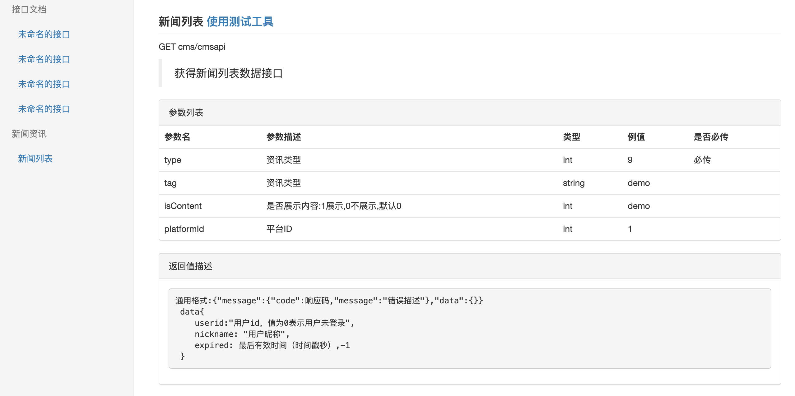

# laravel接口文档生成,测试工具生成工具
> 目前已经是基本可用版本，不过测试工具返回类型只有json类型

# 基本使用方法
1. composer 安装包:
  > composer require --dev wenma1993/laravel-doc 
2. 配置服务提供者, config/app.php 在 'providers'中加入
  > Apidoc\ApiDocServiceProvider::class,
3. 在controller方法上编写文档,具体编写见下面"文档编写规则"
4. 生成文档(生成前会删除所有文档):
  > php artisan doc:generate {route}
  > 增加 route 前缀匹配生成 默认全部
5. 查看文档: http://url/docs/index.html
6. 清空所有文档:
  > php artisan doc:cleanall

# 基本用法生成物描述
生成物包含文档页和测试工具页，下面是截图: 
文档图片:

工具图片:

# 文档编写方法：
### 基本模板
<pre>
    /**
     * @Desc 新闻列表
     * @Description 获得新闻列表数据接口
     * @H type int 资讯类型 9 Must
     * @Header type int 资讯类型 9 Must
     * @Param tag string 资讯类型 demo
     * @Param isContent int 是否展示内容:1展示,0不展示,默认0 demo
     * @Param platformId int 平台ID 1
     * @Response 通用格式:{"message":{"code":响应码,"message":"错误描述"},"data":{}}
     * data{
     *    userid:"用户id，值为0表示用户未登录",
     *    nickname: "用户昵称",
     *    expired: 最后有效时间（时间戳秒）,-1
     * }
     */
     public function login(Request $request){}
</pre>
<pre>
    Route::group(['prefix' => 'auth', 'middleware'=>[], 'grouptitle'=>'用户中心'], function(){
        Route::post('login','Auth\LoginController@login')->name("auth.login");
    });
</pre>

### 标签描述
> 标签解析规则方法注释中@开头，空格结尾，空格过后是标签内容两边的空格将去掉,内容内的@xxx将不作为标签识别，参数标签@Param做了特殊处理可以包含默认参数测试标签@ParamTest
#### @Desc
> 接口名称
#### @Description
> 接口描述
#### @Header
> 支持header 参数 
#### @Param
> 参数标签，代表http请求的参数描述，格式如下:@Param type int 资讯类型 9 Must @Param 字段名称 类型 注释 例值 是否必传
#### @Response
> 参数结果描述，显示时候显示在\<pre\>\</pre\>中保存格式

### 接口分组
> 文档中支持用户分组的,如模板中使用'grouptitle'=>'用户中心'为路由分组命名为"用户中心"，这将在文档中体现，如果没有这个分组标题，将不在文档中体现分组,文档上最好是一层分组，如果有多层将一次显示，但是没有层次缩进